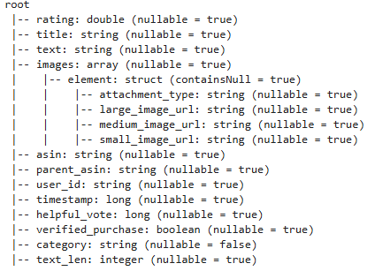
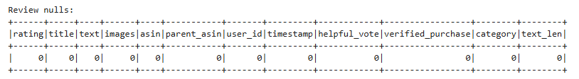
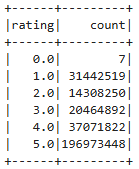
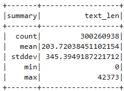

# Amazon Rating Predictor

## Methods and Results

### 1. Data Exploration

We began by understanding the structure and distribution of our dataset, which consisted of over **300 million** product reviews:

**Total Reviews**: `300,260,938`

#### Schema Overview

#### Null Values
We observed **zero missing values** across all columns:

#### Rating Distribution

This distribution suggests a strong skew toward positive ratings.

#### Text Length Summary

This reveals high variability in review length, which could influence model predictions and require normalization or capping during preprocessing.

### 2. Preprocessing

Given the massive size of the dataset and performance constraints, we implemented the following preprocessing strategies:

- **Sampling**: We initially attempted to train on the full dataset but encountered severe memory and runtime issues. As a solution, we:
  - Sampled **1%**, then **5%**, and finally **10%** of the dataset.
  - Found that accuracy remained fairly **constant across samples**, while computational time increased exponentially.
- **Feature Selection**:
  - Used features such as `text_len`, `category`, `verified_purchase`, and `helpful_vote` as predictors.
  - Encoded categorical features like `category`.
  - Avoided using full `text` or `images` fields directly due to dimensionality and noise.
- **Target Variable**:
  - Predicted `rating` as a regression task.

---

### 3. Model 1 – Linear Regression

We began with a **linear regression model** as a baseline.

#### Motivation:
  - **Computationally cheap**, allowing for quick tuning of parameters
  - Simple and easy to interpret

#### Experiments & Parameter Tuning

We experimented with many different custom rounding bins to improve accuracy and help mitigate the class imbalance of the rounded predictions. 

| Rounded Rating | Custom Bin Interval |
|----------------|---------------------|
| 1.0            | (-∞, 1.50)          |
| 2.0            | [1.50, 2.85)        |
| 3.0            | [2.85, 3.30)        |
| 4.0            | [3.30, 4.05)        |
| 5.0            | [4.05, ∞)           |

| Rating | True Count | Predicted Count |
|--------|------------|-----------------|
| 1.0    | 138,758    | 136,333         |
| 2.0    | 47,918     | 45,963          |
| 3.0    | 83,963     | 87,322          |
| 4.0    | 171,332    | 174,213         |
| 5.0    | 214,629    | 212,769         |

However it did not perform as well as we hoped. 

- **Reasons for poor performance**:
  - Assumes linearity, which doesn't capture complex interactions.
  - Unable to model nonlinear relationships between review characteristics and rating.
  - Product categories introduce heterogeneity, which the linear model couldn't adjust for effectively.

---

### 4. Model 2 – Random Forest

To better capture non-linear patterns and interactions in the data, we transitioned to a **Random Forest** model.

#### Motivation:
- Handles **categorical variables** more effectively.
- Captures **nonlinear dependencies**.
- More robust to outliers and noise.

#### Implementation & Experiments

We conducted several trials to assess the effect of sample size and model parameters on performance.

##### Sample Size Experiments

| Sample Size | Accuracy Impact | Processing Time Impact |
|-------------|------------------|-------------------------|
| 1%          | 0.6564           | 266.54 seconds          |
| 5%          | 0.6558           | 583.98 seconds          |
| 10%         | 0.6559           | 1150.65 seconds         |

- We observed that compared to linear regression, random forest was significantly more accurate. However, within the different sampling sizes for random forest, **accuracy did not significantly improve** with larger samples, but **processing time increased drastically**.

##### Hyperparameter Tuning

- **Number of Trees**: 10  
- **Max Depth**: 5

These parameters were chosen to reduce runtime. Accuracy remained relatively stable when increasing these values, while runtime increased noticeably.

#### Link to notebook
The notebook containing all of the models can be found [here.](https://github.com/Nolan-Lo/Amazon_Product_Rating_Predictor/blob/Milestone4/Notebook/Amazon_Reviews_M4.ipynb)

## Discussion

### 1. Data Subsampling and Preprocessing
We first tried to train on the full ~300 million-record dataset but ran into memory errors and prohibitively long runtimes, even with a 20 percent subset. To address this, we sampled 1%(3 million), 5% (15 million), and 10% (30 million) of the data. The random forest achieved 65.64% accuracy on 1% data, 65.58% on 5% data, and 65.59% on 10% data. Training and test accuracies converged around 65.6 %, showing the model was neither underfitting nor overfitting. This consistency indicates that, beyond a modest subsample, simply adding more data did not improve performance under our current feature set.

### 2. Reflecting on the Regression-Based Model
We began with linear regression because of its simplicity and interpretability, rounding continuous outputs to discrete star ratings. We undersampled the 5.0 star rating as they accounted for almost half of the entire dataset. We began with traditional rounding, which had a low accuracy of around 30%. We then decided to tune our rounding parameters, transitioning to custom bins. This achieved 52.33% test accuracy, while a vast improvement, ultimately fell short of expectations. We also tried logistic regression and XGBoost on the same features, but saw no significant gains. Treating ratings as continuous ignored their categorical nature, so we shifted our focus to classification methods.

### 3. Interpreting the Random Forest Results
We chose a random forest classifier to handle high-dimensional, sparse features without extensive preprocessing. It scored about 65.6% accuracy across all sample sizes, with training and test accuracies closely matched. These results seem plausible for natural language data, yet the mid-sixties plateau suggests our features capture only surface-level signals.

### 4. Category Specific Modeling
Product categories on Amazon differ in vocabulary and rating patterns. A single model risks washing out these distinctions. Future work will involve training separate models for each major category, tailoring feature engineering and algorithm choice to the data volume and characteristics of each group.

### 5. Shortcomings
Our mid-sixties accuracy is credible for a first pass, but several limitations stand out:
 Feature engineering relied on basic term-frequency vectors rather than richer representations like TF-IDF, embeddings, or transformer encodings.
 A skew toward four- and five-star reviews biases predictions, suggesting class weighting or resampling may help.
Hyperparameter tuning was manual. An automated grid or Bayesian searches could find better settings.
Runtime limitations caused memory errors on larger subsets, highlighting the need for distributed training pipelines.

## Statement of Collaboration

Nolan Lo. Data Scientists. I contributed to all parts of the project. We primarily worked, collaborated and discussed as a team on all parts of the project. We did not have a designated team leader, but I did help with creating the github, scheduling, and starting discussions of how work and responsibilities will be allocated. For milestone 1 we all collaborated on the abstract, bouncing ideas off each other. We ended up using my final draft of the abstract, but it was a culmination of all our ideas and drafts. For milestone 2  I contributed to our data analysis tables and plots, and combined, aggregated, and submitted our final github branch. For milestone 3 I created the random forest model that we ended up using as our final model. For milestone 4 we met and allocated which sections would be written by who. The majority of my work for the writeup can be found in the methods and results section, specifically the data analysis, and random forest model, results, and observations. 
